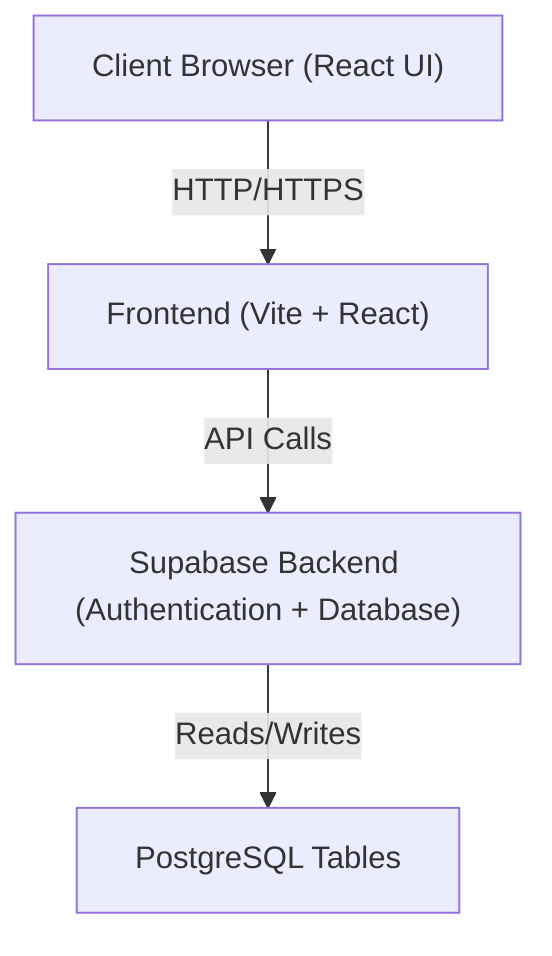
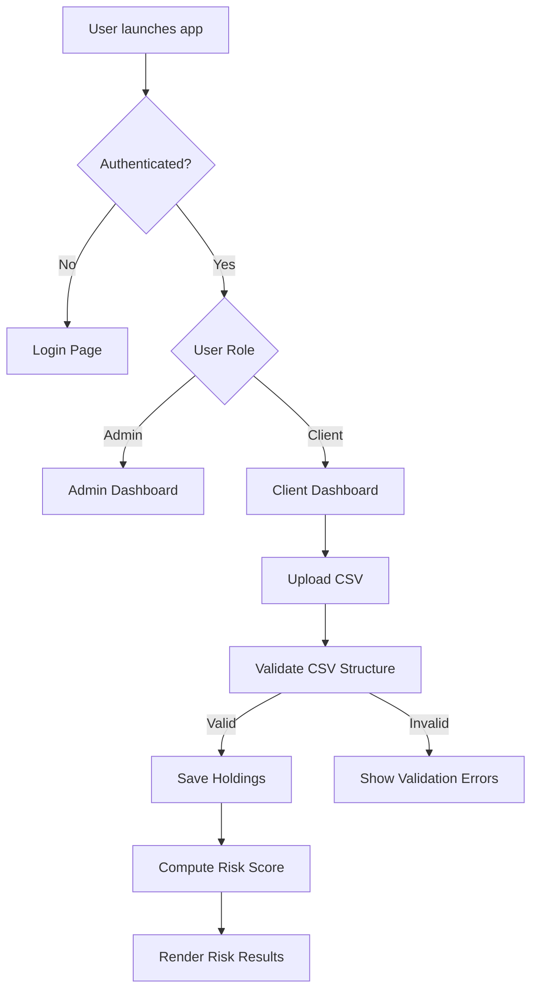
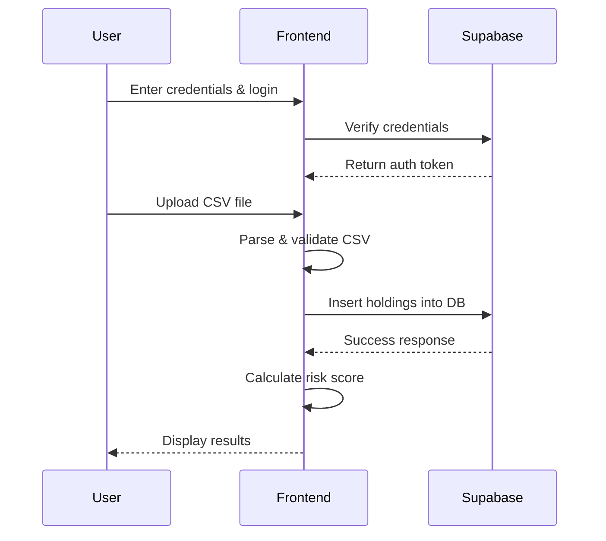

# Solution Blueprint (Focused)

This document provides the required high-level views based on the Analyst’s instructions:
- **Application landscape**
- **Process overview**
- **Integration and interfaces**
- **Data model**

---

## 1. Application Landscape

Below is a simplified component view of the system architecture illustrating major parts and their relationships:

## 2. Process Overview

## 3. Integration and Interfaces

## 4.Data Model

Users
---------
id (PK)
email
role (admin/client)
created_at

Holdings
---------
id (PK)
client_id (FK -> Users.id)
ticker
purchase_price
quantity
market_value
risk_score
created_at
