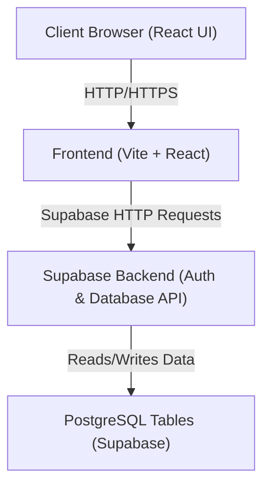
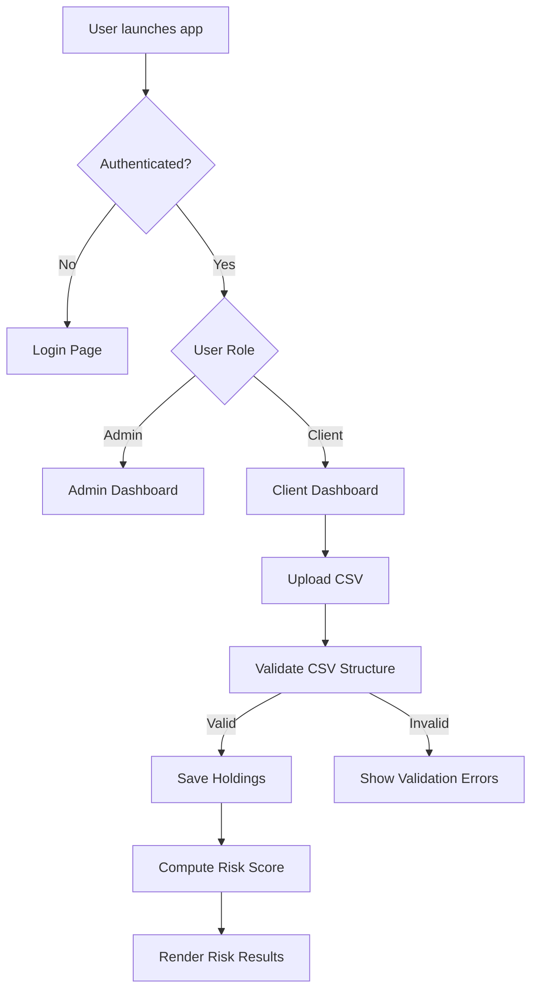
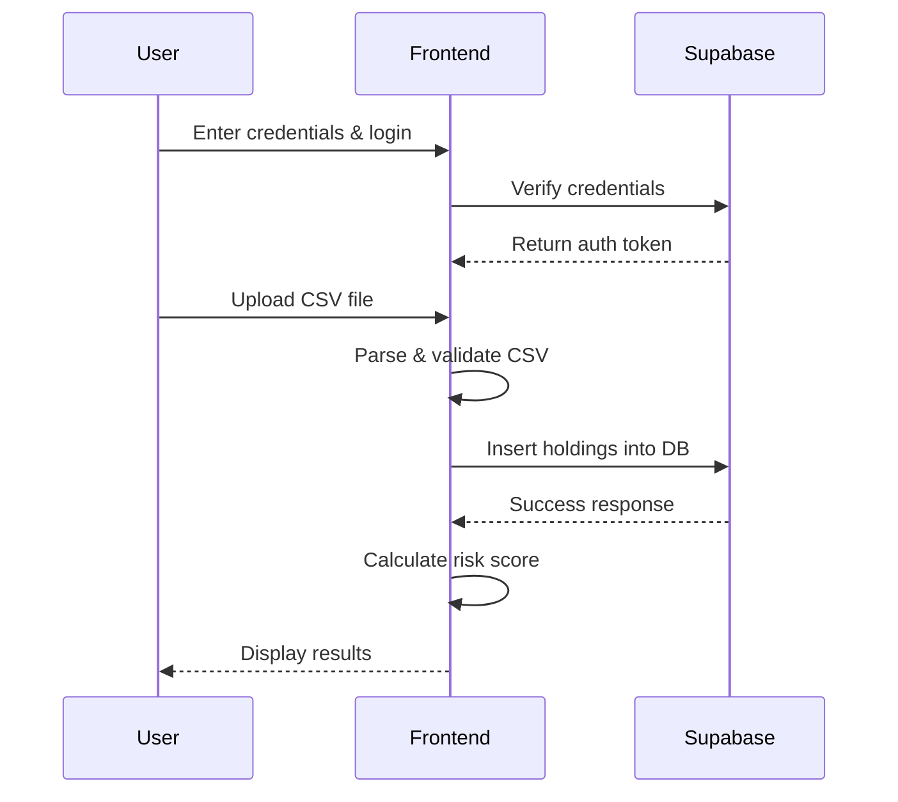

# Solution Blueprint 

## 1. Application Landscape

Below is a simplified component view of the system architecture illustrating major parts and their relationships:

## 2. Process Overview

## 3. Integration and Interfaces

# Data Model

### `profiles`

| Column       | Type      | Description                      |
|--------------|-----------|----------------------------------|
| id           | uuid      | Primary key                      |
| email        | text      | User email                      |
| full_name    | text      | Full name of the user            |
| created_at   | timestamp | Record creation time             |
| updated_at   | timestamp | Record last update time          |

---

### `user_roles`

| Column     | Type      | Description                             |
|------------|-----------|-----------------------------------------|
| id         | uuid      | Primary key                             |
| user_id    | uuid      | FK → `auth.users.id` (Supabase auth)    |
| role       | app_role  | Role name (e.g., admin, client)         |
| created_at | timestamp | Timestamp when role was assigned        |

---

### `clients`

| Column                     | Type      | Description                                  |
|---------------------------|-----------|----------------------------------------------|
| id                        | uuid      | Primary key                                  |
| client_name               | text      | Human-friendly name of the client            |
| client_id                 | text      | Reference identifier                         |
| portfolio_value           | numeric   | Total value of the portfolio                 |
| risk_score                | numeric   | Computed overall risk score                  |
| risk_tier                 | text      | Risk category (e.g., Low/Medium/High)        |
| volatility_score          | numeric   | Derived volatility metric                    |
| sector_concentration_score| numeric   | Sector diversification measure               |
| geography_score           | numeric   | Regional diversification score               |
| top_sectors               | jsonb     | Top sector breakdown (JSON)                  |
| top_regions               | jsonb     | Top region breakdown (JSON)                  |
| notes                     | text      | Optional free-text notes                     |
| created_at                | timestamp | Creation timestamp                           |
| updated_at                | timestamp | Last modification timestamp                  |

---

### `client_portfolios`

| Column       | Type      | Description                                   |
|--------------|-----------|-----------------------------------------------|
| id           | uuid      | Primary key                                   |
| client_id    | uuid      | FK → `clients.id`                             |
| portfolio_name | text    | Name of the portfolio                         |
| created_at   | timestamp | Portfolio creation timestamp                  |
| updated_at   | timestamp | Portfolio last updated timestamp              |

---

### `portfolio_holdings`

| Column            | Type      | Description                                              |
|------------------|-----------|----------------------------------------------------------|
| id                | uuid      | Primary key                                              |
| client_id         | uuid      | FK → `clients.id`                                        |
| portfolio_id      | uuid      | FK → `client_portfolios.id`                              |
| stock_ticker      | text      | Ticker symbol of the asset                               |
| stock_name        | text      | Name of the security                                     |
| sector            | text      | Sector classification                                    |
| region            | text      | Geographic region                                        |
| asset_type        | text      | Asset type (e.g., stock, bond)                           |
| shares            | numeric   | Number of shares                                         |
| market_value      | numeric   | Market value of the holding                              |
| cost_basis        | numeric   | Original cost basis of the holding                       |
| portfolio_weight  | numeric   | Weight of this holding in the portfolio                  |
| volatility        | numeric   | Volatility metric of the holding                         |
| acquisition_date  | date      | Date holding was acquired                                |
| expected_sell_date| date      | Optional desired sell date                               |
| is_bullish        | bool      | Boolean indicating bullish sentiment                     |
| created_at        | timestamp | Record creation timestamp                                |
| updated_at        | timestamp | Last modification timestamp                               |

---

### Notes

- **auth.users** is managed by Supabase and represents authenticated users.
- The `user_roles` table links Supabase users to application roles (`admin`, `client`).
- The `clients` table stores summary metrics and risk results.
- The `client_portfolios` table groups holdings by portfolio.
- The `portfolio_holdings` table stores detailed positions that feed risk and value calculations.

---

